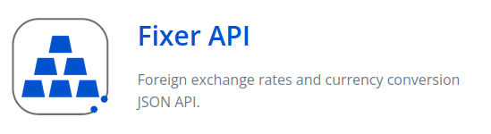
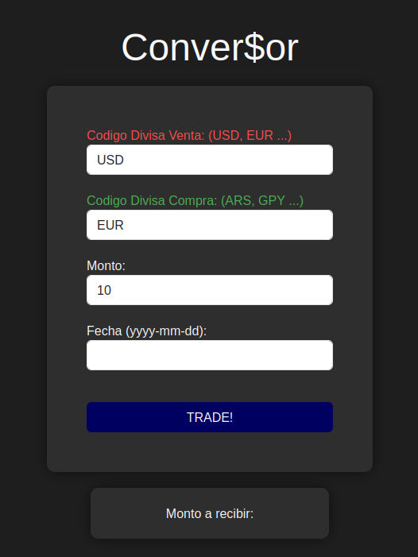
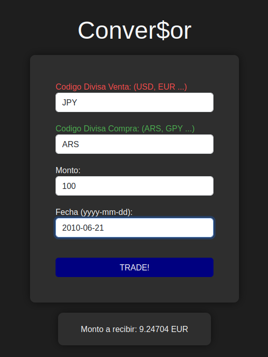
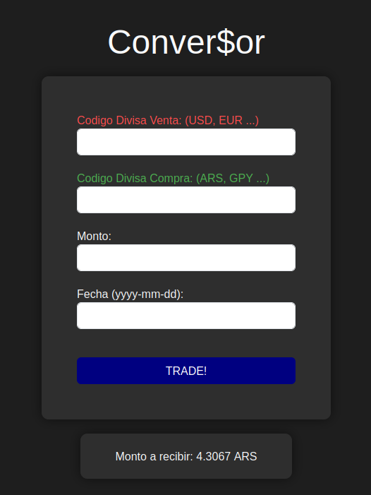

# Implementación de una API  en un Proyecto Django

##   INDICE 


- [Introduccion](#introducción)
- [Requisitos](#requisitos-previos)
- [API](#api-utilizada)
- [implementacion](#implementacion-en-proyecto)
- [Bibliografia](#bibliografia)


## Introducción

En este documento, explicare la API utilizada en mi proyecto, y de que manera 
esta fue implementada. De la misma forma, explicare las librerias utilizadas 
las cuales fueron instaladas en un pipvenv.

## Requisitos Previos

Las siguientes librerias fueron utilizadas:

- Django 5.0.6
- requests 2.32.3
- Tree 0.2.4

>Tree es utilizado para una visualizacion mas limpia del proyecto, pero no es estrictamente necesario

###### Estas librerias fueron istaladas mediante el comando "pip install"


```shell
    $ pip install django

    $ pip install requests

    $ pip install Tree
```

## API utilizada

La API que yo seleccione para mi trabajo se llama: "FIXER API"



### Descripcion

La Api lo que hace es recolectar datos financieros en timpo real, lo que nos 
permite conocer el valor de multiples activos/divisas con exactitud casi perfecta.

Tambien esta API se encarga de guardar datos historicos de los mimsos, permitiendonos la cotizacion de, por ejemplo, 10 EUROS (EUR)  a DOLARES(USD) el 12 de Junio de 2010


## Implementacion en Proyecto

>Requerido

La forma en la que la implemente en mi proyecto Django fue mediante un "Conversor Financiero"

En el cual usted podria colocar cual activo le gustaria Intercambiar (Divisa Venta)
Y cual activo le gustaria obtener (Divisa Compra)

Luego, debe de colocar la cantidad de dicho activo que usted desea cambiar

##### Ejemplo:

>>Al clickear el boton "TRADE!" se borran los campos para que puedas realizar otra conversion mucho mas rapido

   

>Opcional

Usted puede tambien colocar una fecha especifica para que se utilize una cotizacion pasada de dichos activos

>>Aqui se ve que en "Monto a recibir" sigue apareciendo los EUROS, ya que aun no e presionado el boton "TRADE!" nuevamente

   


### Como funcionan las requests en esta API

La url mediante la cual hacemos la request se ve tal que asi:


>url con fecha especifica
```python
    url = f"https://api.apilayer.com/fixer/convert?to={divisa_compra}&from={divisa_venta}&amount={cantidad}&date={fecha}"
```

>url sin fecha especifica

```python
    url = f"https://api.apilayer.com/fixer/convert?to={divisa_compra}&from={divisa_venta}&amount={cantidad}"
```


Los parametros los cuales le pasamos a la request son los siguientes:

>request

    response = requests.request("GET", url, headers=headers, data = payload)

El método requests.request tiene varios parámetros:

    method: el método HTTP a utilizar, en este caso "GET".

    url: la URL a la que se envía la solicitud.

    headers: los encabezados HTTP que se envían con la solicitud (en este caso se le envia la APIkey).

    data: el payload o cuerpo del mensaje HTTP (en este caso vacío).


### Como se trabajo la response de la request

Primero se obtienen los valores del "forms" hecho en la template1.html

```html
    <form action="../../Proyecto1Main/views.py" method="POST">
                
                <div class="form-group">
                    <label for="currency1" id="ventas">Codigo Divisa Venta: (USD, EUR ...)</label>
                    <input type="text" class="form-control" id="currency1" name="currency1" required>
                </div>
                <div class="form-group">
                    <label for="currency2" id="compras">Codigo Divisa Compra: (ARS, GPY ...)</label>
                    <input type="text" class="form-control" id="currency2" name="currency2" required>
                </div>
                <div class="form-group">
                    <label for="amount">Monto:</label>
                    <input type="text" class="form-control" id="amount" name="amount" required>
                </div>
                <div class="form-group">
                    <label for="date">Fecha (yyyy-mm-dd):</label>
                    <input type="text" class="form-control" id="date" name="date" pattern="\d{4}-\d{2}-\d{2}" title="Por favor ingresa la fecha en formato yyyy-mm-dd">
                </div>
                <button type="submit" class="btn btn-trade" id="tradeButton">TRADE!</button>
    </form>
```

> El token CSRF es una medida de seguridad que protege contra ataques de falsificación de solicitudes entre sitios. Ayuda a garantizar que las solicitudes HTTP provienen del usuario legítimo y no de un atacante malintencionado.

Luego, se los manda mediante el metodo POST al views.py para ser procesados y enviados mediante una request a la API (como se especifico arriba)

Una vez obtenida la response de la API, se la trabajo de la siguiente manera:
```python
    if response.status_code == 200:
                data = response.json()
                context = {'data': data}
                return render(request, 'proyecto1/template1.html', context)
            else:
                return HttpResponse(f"Error: {response.status_code}")
```

Lo que hace este script es:
1. Una vex obtenida la response, busca el "codigo de estado", para ver si se completo corretcamente o se encontro con una exepcion/error
2. Supongamos que todo se dio de forma correcta (response.status_code == 200). 
    - Lo que hace el codigo es crear una Diccionario python con la informacion obtenida del json, de la siguiente forma:
```python
                    data = response.json()
                    context = {'data': data}
```

3. Una vez creada la Diccionario, se "renderiza" el template pasandole la Diccionario recien creada y la request realizada.

4. El template lo procesa para luego colocar en el campo que dice: "Monto a recibir" los valores correspondientes.

```html
    <div class="result">
            <label for="result">Monto a recibir: {{ data.result }} {{ data.query.to }}</label>
    </div>
```

- data.result es el valor que obtendriamos del valor al que estamos cambiando
- data.query.to es el valor hacie el que estamos cambiando

##### Entonces:

Suponiendo que hacemos la siguiente conversion:

    divisa venta: USD (dolar)
    divisa compra: EUR (Euro)
    monto: 10
    Fecha:  (nada)

lo que obtendriamos en ese campo seria, en este caso:

    data.result = 9.24704
    data.query.to = EUR

Por lo que se printearia de la siguiente forma:

    Monto a recibir: 9.24704 EUR


## Bibliografia

API link: https://apilayer.com/marketplace/fixer-api?e=Sign+In&l=Success

github repository link: https://github.com/Carlitosh21/Carlos-Vercellone-PG3_ITSVillada2023/tree/main/Proyecto-APIS


