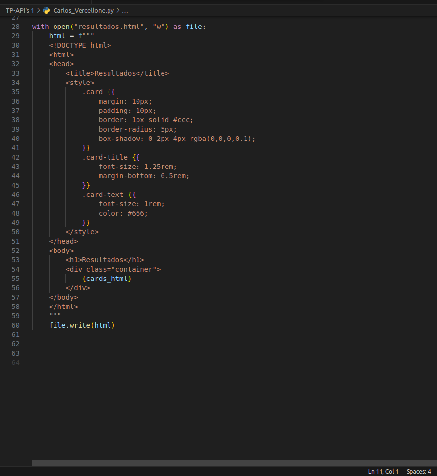

#   INFORME TP-APIS

#   INDICE 

- **Descripcion**
- **Consigna N1**
- **Consigna N2**
- **Consigna N3**
- **Consigna N4**
- **Consigna N5**
- **Conclusion**
- **Bibliografia**

# Descripción de la API de JsonPlaceholder

JsonPlaceholder es un servicio gratuito que proporciona una API REST simulada para realizar pruebas, prototipos o experimentar con solicitudes HTTP. Algunas características de la API de JsonPlaceholder son:

- **Recursos disponibles**: La API proporciona recursos como `posts`, `comments`, `users`, `todos`, y `albums`, que pueden ser consultados y manipulados a traves de solicitudes

- **Metodos**: Se pueden utilizar todos los metodos aprendidos hasta la fecha (GET, POST, PUT, DELETE)

- **Endpoints bien definidos**: Cada recurso tiene sus propios endpoints bien definidos. Por ejemplo, para obtener todos los posts, el endpoint sería `/posts`.

#   Consigna 1

Elegi la Api llamada JsonPlaceHolder

# Consigna 2

Genere un token para utilizar la API

#   Consigna 3

- **A**

    Utilice un metodo get para obtener los "Posts" de la Base de Datos de JsonPlaceHolder

    

-   **B**

    Utilice los metodos POST y PUT para crear un nuevo post dentro de la Base de Datos (POST) y luego actualizarlo (PUT)

    
    

-   **C**

    Utilice el parametro de busqueda por ID, para buscar todos los posts que tengan un ID de POst = 1

    

-   **D**

    Realice una consulta mixta haciendo que me muestre todos los posts con ID de post = 1 y que muestre todos los posts que tengan un "id" distinto de 2

    

-   **E**

    Utilice el operador logico de igual o mayor a, para que me muestre los posts con  "id" => 2

    

#   Consigna 4

    Segun lo que investigue consumir los endpoints de la API se refiere a hacer uso de las URLs específicas proporcionadas por dicha API para enviar solicitudes y recibir respuestas. Cada punto final representa una funcionalidad o recurso específico que la API expone y al cual se puede acceder mediante una solicitud HTTP, como GET, POST, PUT, DELETE, entre otros.

    Por lo tanto al hacer un GET https://jsonplaceholder.typicode.com/posts, estariamos logrando este objetivo

    

#   Consigna 5

    Lo que hice fue hacer el archivo python donde se haga un get y se muestre el contenido en una tabla con la libreria tabulate, luego al ejecutarlo se creara un archivo HTML que al ejecutarlo se mostrara el contenido obtenido del GET en cartas de html

#   Conclusion

    En conclusión, la utilización de JsonPlaceholder proporciona una manera conveniente y eficaz de trabajar con una API REST simulada para realizar pruebas, prototipos o experimentos.Su fácil acceso, recursos predefinidos y operaciones dhacen que sea una herramienta valiosa para desarrolladores que necesitan interactuar con una API RESTful de forma rápida y sencilla. 

#   Bilbiografia

    https://jsonplaceholder.typicode.com/guide/
    https://www.json.org/json-es.html
    https://www.ibm.com/docs/es/baw/20.x?topic=formats-javascript-object-notation-json-format

